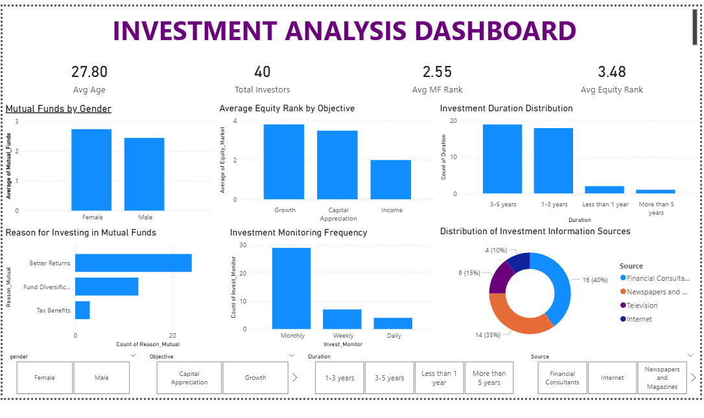

# 📊 Investment Analysis Dashboard using Power BI

An interactive **Power BI Dashboard** developed to analyze investor behavior, investment preferences, financial objectives, and decision-making patterns using data visualization and DAX.

---

## 🚀 Project Overview

This project focuses on understanding how investors choose different investment options based on factors such as:

- Gender
- Investment Objectives
- Investment Duration
- Investment Monitoring Frequency
- Reasons for Investment
- Source of Investment Information

The dashboard transforms raw investment data into meaningful business insights using interactive visualizations.

---

## 🎯 Project Objectives

- Analyze investor demographics
- Compare investment preferences across genders
- Study investment objectives
- Examine investment duration and monitoring habits
- Identify reasons behind investment choices
- Explore the most common sources of investment information
- Build an interactive dashboard for business decision-making

---

## 🛠️ Tech Stack

- **Power BI Desktop**
- **Power Query**
- **DAX (Data Analysis Expressions)**
- **Data Modeling**
- **Data Visualization**

---

## 📈 Dashboard Features

- ✅ KPI Cards
- ✅ Interactive Slicers
- ✅ Gender-wise Analysis
- ✅ Investment Objective Analysis
- ✅ Investment Duration Analysis
- ✅ Monitoring Frequency Analysis
- ✅ Reasons for Investment
- ✅ Information Source Analysis
- ✅ Interactive Dashboard

---

## 📊 KPIs

- Average Age
- Total Investors
- Average Mutual Fund Rank
- Average Equity Market Rank

---

## 📌 Visualizations

- Gender Analysis
- Investment Objective Analysis
- Investment Duration Distribution
- Investment Monitoring Frequency
- Reasons for Investment
- Investment Information Sources
- Interactive Filters (Slicers)

---

## 💡 Skills Demonstrated

- Data Cleaning
- Data Transformation
- DAX Measures
- Dashboard Development
- Business Intelligence
- Data Visualization
- Analytical Thinking
- Interactive Reporting

---

## 📂 Project Structure

```text
Investment_Analysis_Project/
│
├── Investment_Analysis_Dashboard.pbix
├── Investment_Dataset.csv
├── Dashboard_Screenshots/
│   ├── Overview.png
│   ├── Gender_Analysis.png
│   ├── Objective_Analysis.png
│   ├── Duration_Monitoring.png
│   ├── Investment_Reasons.png
│   ├── Information_Sources.png
│   └── Final_Dashboard.png
│
└── README.md
```

---

## 📸 Dashboard Preview

Below is the final interactive Power BI dashboard developed as part of the Investment Analysis Project.

## 📊 Final Dashboard



---
## 📚 Key Learnings

- Building interactive dashboards in Power BI
- Creating DAX measures and KPI Cards
- Using slicers for dynamic filtering
- Transforming raw data into actionable insights
- Designing business intelligence reports

---

## 👩‍💻 Author

**Aastha Kansal**

- 💼 Aspiring Data Analyst
- 🔗 LinkedIn: https://www.linkedin.com/in/aastha-kansal-561533311
- 💻 GitHub: https://github.com/aasthakansal47

---

## ⭐ If you found this project helpful, consider giving it a star!
